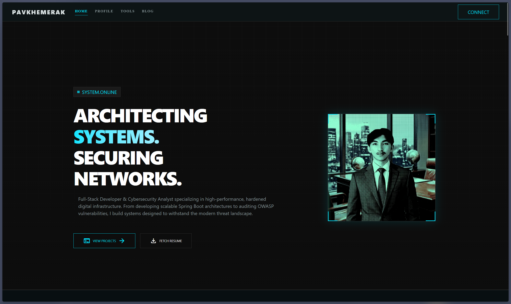
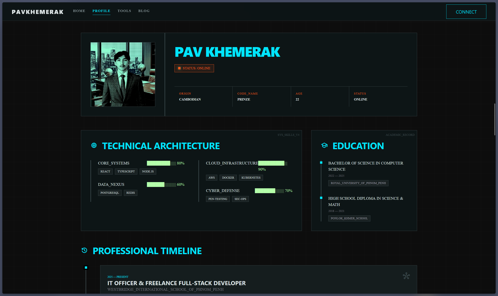
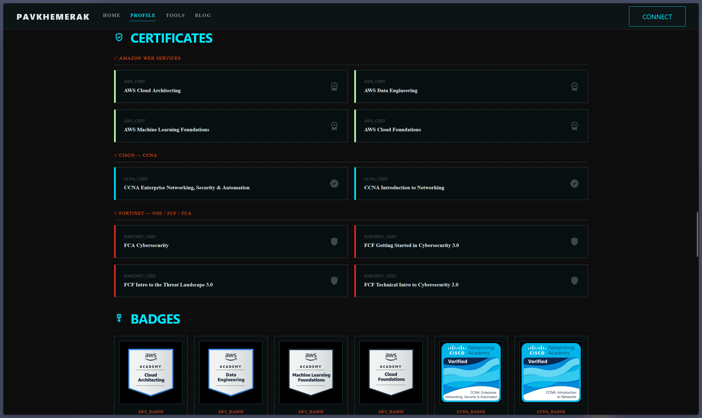
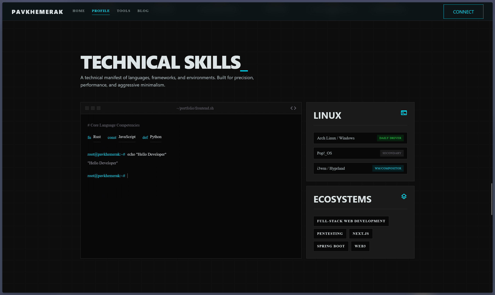
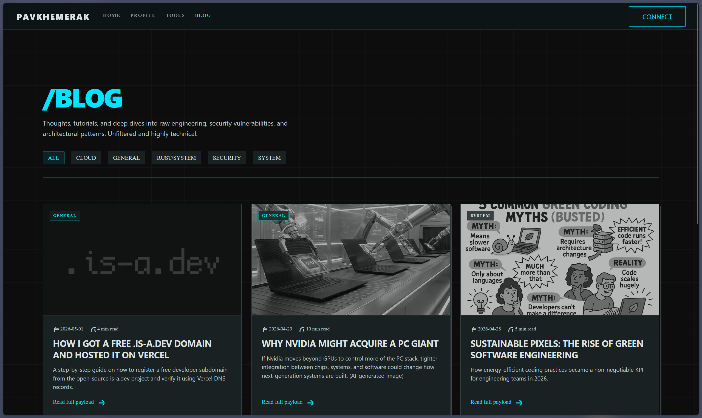

# pavkhemerak.is-a.dev

This project is a high-performance, **Cyber-Minimalist Developer Portfolio** designed to serve as a central hub for my professional identity, technical writing, and project showcases. Built with a focus on speed, type safety, and a "terminal-inspired" aesthetic, it bridges the gap between a traditional resume and a dynamic technical blog.

The site follows the **Obsidian Cyber Minimalist** design system—a brutalist approach characterized by high-contrast accents, sharp geometric edges, and a layout that prioritizes information density and clarity.

---

## Project Preview

  

  

  

  

  

---

## Core Features

*   **Dynamic Portfolio:** A single-page, vertically-integrated experience featuring hero sections, work history timelines, and interactive skill visualizations.
*   **CMS-Integrated Blog:** A full-featured blog engine that renders Markdown content fetched from a custom backend, supporting category filtering and code syntax highlighting.
*   **Real-time Integrations:** Live data feeds including GitHub activity tracking and custom utility tools (such as network health checks and blockchain analyzers).
*   **Responsive Brutalism:** A mobile-first design that maintains its sharp, grid-based aesthetic across all screen sizes.

---

## Tech Stack

### Frontend Architecture
*   **Next.js 16 (App Router):** Leveraging server-side rendering (SSR) and streaming for optimal performance.
*   **TypeScript:** Ensuring strict type safety across the entire data layer.
*   **Tailwind CSS v4:** Driving the design system through a custom configuration of "Cyber Cyan" and "Logic Orange" utility tokens.

### Content & UI
*   **Markdown:** Rendered via `react-markdown` with GFM support for technical documentation.
*   **Typography:** A dual-font strategy using **Inter** for legibility and **Space Grotesk** for that distinctive mono-spaced technical feel.
*   **Icons:** Google Material Symbols for a clean, consistent iconography set.

### Backend Synergy
*   **Rust API:** The application is architected to interface with a high-performance Rust-based backend for content management and external API orchestration.

---

## Usage Disclaimer

**This project is intended for personal and educational purposes only.** 

It is designed as a private professional portfolio and is **not intended for commercial use**, redistribution, or as a commercial product. The codebase serves as a public demonstration of technical proficiency and design implementation.
